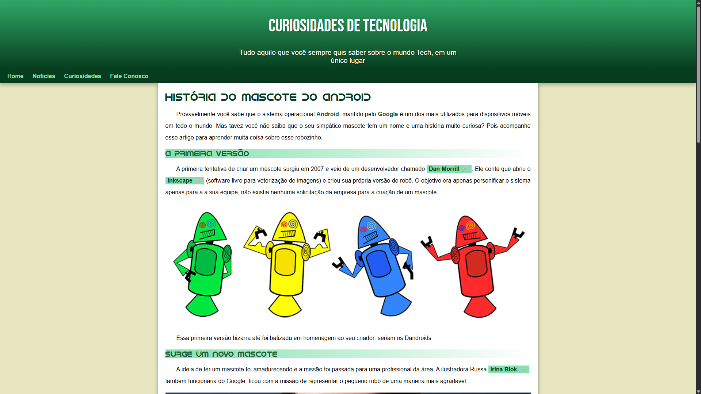
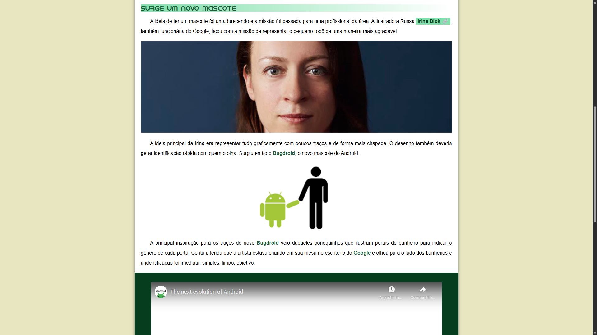
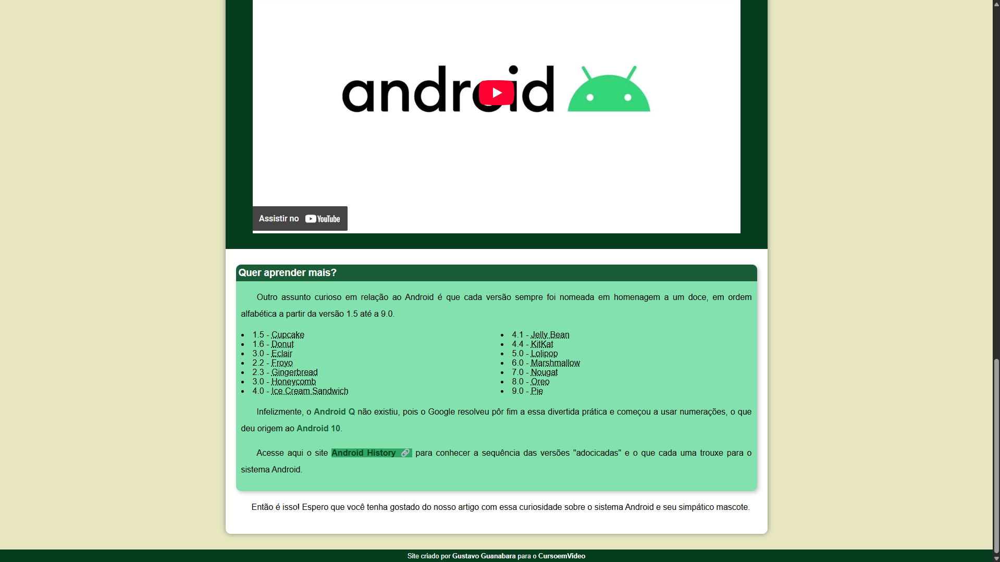

# Projeto Android

Este é um projeto desenvolvido durante o curso de **HTML5 e CSS3** do canal [Curso em Vídeo](https://www.youtube.com/CursoemVideo), ministrado pelo professor Gustavo Guanabara. O objetivo foi praticar os conceitos aprendidos construindo uma página web responsiva e semântica sobre a história do mascote do sistema Android.

---

## Conteúdo abordado

Neste projeto, foram utilizados os seguintes conceitos:

- Estrutura básica HTML
- Tags semânticas (`<header>`, `<main>`, `<section>`, `<article>`, `<footer>`, etc.)
- Estilização com CSS
- Importação de fontes do Google Fonts
- Utilização de imagens e vídeos
- Responsividade básica
- Criação de um layout simples, limpo e funcional

---

##  Prints do projeto

### Página inicial

---

### Conteúdo sobre o mascote

---

### Versões do Android

---

## Créditos

Projeto realizado durante as aulas do [Curso em Vídeo](https://www.cursoemvideo.com/), com orientação de **Gustavo Guanabara**.
